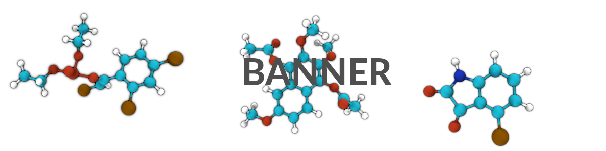
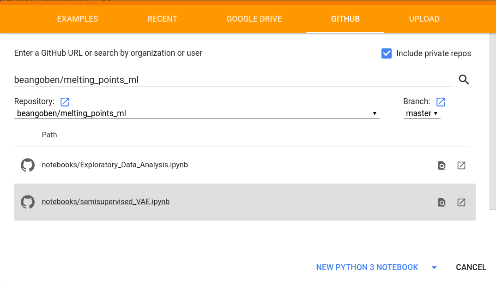

# Melting Point Insights and Prediction from a Diversified Machine Learning Strategy




Intro statement

## How do I run this?
There are two options:
* **Locally**

This requires a standard scientific Python 3 environment with rdkit and tensorflow+pytorch and a cloned github.
A simple way of getting that is installing [Anaconda](https://www.anaconda.com/distribution/#download-section).

First to clone the github and then replicate a new anaconda environment using the **environment.yml** file:
```
git clone https://github.com/argonne-lcf/melting_points_ml
cd melting_points_ml
conda env create -f environment.yml
```

* **Remotely** via Google Colab

Visit [google colab](https://colab.research.google.com/) (requires a gdrive account) and open a colab notebook via github:



## What's inside?

* **data**
  - 47K: Folder of json, each containing information for one molecule.
  - \*csv: csv files.
* **notebooks**: Jupyter notebooks (run these!)
  - Exploratory_Data_Analysis.ipynb
  - semisupervised_VAE.ipynb
  - Graph_Neural_Networks.ipynb
  - Gaussian_Processes.ipynb
* **code**: Repo specific modules for training and creating the models.
* **results**: Figures and weights for models.
* **media**: Assorted images.

## Acknowledgements
This research used resources of the Argonne Leadership Computing Facility, which is a DOE Office of Science User Facility supported under Contract DE-AC02-06CH11357. Argonne National Laboratory’s work was supported by the U.S. Department of Energy, Office of Science, under contract DE-AC02-06CH11357.

## Code contributors
* Benjamin Sanchez-Lengeling <beangoben::AT:::gmail.com>
* Ganesh Sivaraman <gsivaraman:AT::anl.gov>
* Nicholas Jackson <jackson.nick.e::aT:gmail.com>
* Alvaro Vazquez-Mayagoitia <alvaro::At:anl.gov>
* Alan Aspuru-Guzik <aspuru::at:utoronto.ca>
